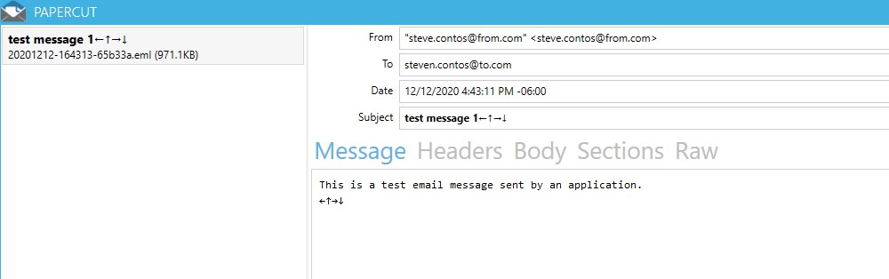
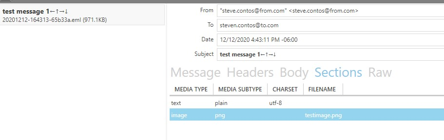

# Serializing MailMessage with MimeKit - Introduction

You may run into a scenario where servers in the DMZ (outside of your domain) need to send emails.
An example of this maybe a contact page which is open to the public and sends a welcome email.

In the past many companies would simply allow their DMZ servers to send via SMTP through an SMTP service which was available both internally and externally. Thereby opening an unwanted security vector for nefarious purposes.

In fact, when looking at the documentation for SmtpClient you will see the following warning:
> We don't recommend that you use the SmtpClient class for new development because SmtpClient doesn't support many modern protocols. Use [MailKit](https://github.com/jstedfast/MailKit) or other libraries instead. For more information, see [SmtpClient shouldn't be used on GitHub](https://github.com/dotnet/platform-compat/blob/master/docs/DE0005.md).


# Background
Recently a customer was upgrading their environments and made the decision to allow the only communication between internal servers and the DMZ be through SQLServer.


As is typical, we had multiple environments, each getting closer to how the production environment is set. The theory being, that by the time we go to production the processes are set and opened port issues etc are resolved before release. 

Although they eventually went with a commercial product ([SMTP2GO](https://SMTP2GO.com)) there was a critical moment were we came to the realization that in-fact, we had released to production and our new outward facing sites could no longer send emails.

There was no going back and as an interim solution, I changed the software we wrote to send the emails through the internal servers using our only open means of communications, our database.

# Solution
So the very first thing I did was try to serialize the MailMessage object. To me this just made sense however the MailMessage object is not serializable.

When researching this, the typical solutions I came across was sending the MailMessage components (Body,BodyEncoding,Subject,MailAddress etc) separately and then assembling on the destination, or creating your own object with similar properties and extending MailMessage to serialize all the properties on this new object.

Both options while doable were error prone and required more thorough testing than what we were prepared for. Because I knew this code was eventually going to be reverted back to using a commercial SMTP provider I wanted to have as little impact on the existing code base as possible.

This is when I discovered [MailKit](https://www.nuget.org/packages/MailKit/) and [MimeKit](https://www.nuget.org/packages/MimeKit/) NuGet packages to do this for me.

Using these packages I was able to modify the existing code without making many architectural changes. In fact I was able to simply replace the call from SmtpClient.Send(MailMessage) with a routine I created to serialize the object and place in a queue (or table) to be processed by another process running as a service worker on an internal machine.

# The Code

```
using (SmtpClient client = new SmtpClient("localhost"))
            {

                // Specify the email sender.
                // Create a mailing address that includes a UTF8 character
                // in the display name.
                MailAddress from = new MailAddress(From,
                   From,
                System.Text.Encoding.UTF8);
                // Set destinations for the email message.
                MailAddress to = new MailAddress(To);
                // Specify the message content.

                using (MailMessage message = new MailMessage(from, to))
                {
                    message.Body = "This is a test email message sent by an application. ";
                    // Include some non-ASCII characters in body and subject.
                    string someArrows = new string(new char[] { '\u2190', '\u2191', '\u2192', '\u2193' });
                    message.Body += Environment.NewLine + someArrows;
                    message.BodyEncoding = System.Text.Encoding.UTF8;
                    message.Subject = "test message 1" + someArrows;
                    message.SubjectEncoding = System.Text.Encoding.UTF8;


                //client.Send(message); Lets not use local SMTP (you could also comment out the using statement above)
                SendMimeMessage(message); //Routine to convert to Mime message and queue up for delivery


                Console.WriteLine("Message Sent. Press any  key to exit.");

                    string answer = Console.ReadLine();
                }
           } 

```

I created a new table in the database, it contained a processed time stamp which is null when created and a binary field to hold the serialized data. The service worker I created was a simple console application which checked the table for new records (time stamp is null) sent the email and wrote the time stamp of when the message was sent.

The code here does not include the communications piece as separate processes but is broken down in a similar fashion to illustrate the concepts.

In the application saving to the Queue...
```
        /// <summary>
        /// This takes the Microsoft Mail Message, and converts to a byte array
        /// which is stored in a local queue which is passed to the MimeMessageSender.
        /// </summary>
        /// <param name="message"></param>
        public void SendMimeMessage(System.Net.Mail.MailMessage message) {

            // MimeMessageReciever is what creates the message
            byte[] QueueArray = MimeMessageReciever(message);

            QueueMessageToDatabase(QueueArray);

        }

        /// <summary>
        /// Converts the System.Net.Mail.Message to the byte array by
        /// coercing into a MimeMessage.
        /// </summary>
        /// <param name="message">System.Net.Mail.Message</param>
        /// <returns></returns>
        private byte[] MimeMessageReciever(System.Net.Mail.MailMessage message)
        {
            // This line is really the most important.
            // It allows you to take a MailMessage type and coerce it into a MimeMesage which is serializable.
            MimeMessage msg = (MimeMessage)message;
            using (MemoryStream stream = new MemoryStream())
            {
                msg.WriteTo(stream);
                var contents = stream.ToArray();
                return contents;
            }
        }
```

In the application reading the Queue you will use something like the following to read the byte array, 
send the email message and update the database.

```
        //This routine should be called in a polling loop.
        public ReadMimeMessage()
        {
            byte[] result;            
            
            //Get messages with null timestamp
            result = QueueMessageFromDatabase();

            //call 
            MimeMessageSender(result)

            //assuming all OK.
            UpdateDatabase();

        }


        /// <summary>
        /// This routine shows how to deserialize the object and send using MailKit.
        /// After pulling from queue, send using this routine.
        /// </summary>
        /// <param name="msg"></param>
        private  void MimeMessageSender(byte[] msg)
        {
            using (MemoryStream msgstream = new MemoryStream(msg))
            {
                MimeMessage msgMime = MimeMessage.Load(msgstream);
                using (var client = new SmtpClient())
                {
                    client.Connect("localhost");
                    client.Send(msgMime);
                }
            }
        }


```
# Tips and Tricks
I use [Papercut](https://github.com/ChangemakerStudios/Papercut) 
to act as my localhost, after the program runs you can inspect the Mail verifying for correctness. Here are some images from my testing.

If your going to poll the database, don't poll too often.






# Wrapping up
In general, I found the MailKit and MimeKit packages easy to use and very stable.
The application is a simple console application which clearly shows the concepts presented.
It does expect two parameters, the to and from email addresses and I have supplied dummy arguments for testing in the command line arguments of the Properties window.
